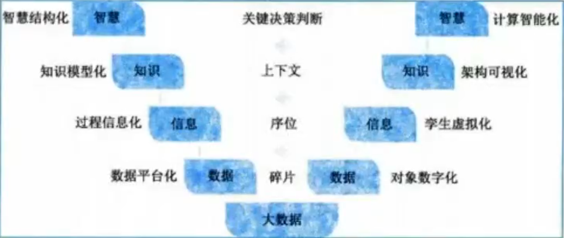

# 信息与信息化
## 信息系统
信息系统的生命周期（**规分设施维**）：
- 系统规划
- 系统分析---逻辑模型
- 系统设计---物理模型
- 系统实施
- 系统运行与维护

## 信息化六要素
- 信息技术应用---龙头(主阵地)
- 信息资源---核心任务
- 信息网络---应用基础
- 信息技术和产业---建设基础
- 信息化人才---成功之本
- 信息化法规---保障

# 现代化基础设施
## 新型基础设施建设
新型基础设施是**以新发展理念为引领**，**以技术创新为驱动**，**以信息网络为基础**，面向高质量发展需要，提供数字转型、智能升级、融合创新等服务的基础设施体系

三个方面：  
1. 信息基础设施（**技术新**）：四通信（5G、物联网、工业互联网、微信互联网），三技术（人工智能、云计算、区块链），两算力（数据中心、智能计算中心）
2. 融合基础设施（**应用新**）：智能交通基础设施、智慧能源基础设施等
3. 创新基础设施（**平台新**）：科技基础设施、科教基础设施、产业技术创新基础设施

七个领域（**打工人特务心计**）：  
1. 大数据中心
2. 工业互联网
3. 人工智能
4. 特高压
5. 5G基建
6. 新能源汽车充电桩
7. 城际高速铁路和城际轨道交通

## 工业互联网
工业互联网平台体系具有四大层级：它以**网络为基础**，**平台为中枢**，**数据为要素**，**安全为保障**。  
* 网络为基础
    * 网络互联（数据传输，内外网）
    * 数据互通（要素之间传输信息的相互理解）
    * 标识解析（RFID、QR、芯片）
* 平台为中枢
    * 边缘层、IaaS、PaaS、SaaS
    * 四个作用（**会用分子**）：数据汇聚、建模分析、知识复用、应用创新
* 数据为要素
    * 三个特性：重要性、专业性、复杂性
* 安全为保障
    * 三个特点：涉及范围广、造成影响大、企业防护基础弱

## 车联网（IoV）
三层体系：
1. 端系统：传感器采集与获取车辆的智能信息、感知
2. 管系统：车与车、车与路、车与网、车与人的互联互通
3. 云系统：云架构的车辆运行信息平台，多元海量信息的汇聚

五种链接：
1. 车与云平台：无线通信
2. 车与车
3. 车与路
4. 车与人
5. 车内设备

# 现代化创新发展
## 两化融合与智能创造
两化：信息化+工业化  
核心：信息化支撑  
四个方面（**极品物业**）：技术融合、产品融合、业务融合、产业衍生  
智能制造成熟度的五个等级：一级（规划级）、二级（规范级）、三级（集成级）、四级（优化级）、五级（引领级）
1. 规划级：对核心业务活动进行流程化管理
2. 规范级：采用自动化技术、信息技术对核心装备和业务活动进行改造和规范，实行单一业务活动的数据共享
3. 集成级：跨业务空间的数据共享
4. 优化级：精准预测和优化，数据挖掘，形成知识、模型
5. 引领级：优化和创新

# 数字中国
四个方面：数字经济、数字政府、数字社会、数字生态

## 数字经济
主要内容构成（**数产理值**）：
1. 数字产业化：数字经济的基础部分。包括云计算、大数据、物联网、工业互联网、区块链、人工智能、AR/VR
2. 产业数字化：以数据为关键要素，以价值释放为核心，以数据赋能为主线
3. 数字化治理：全社会的数据互通
4. 数据价值化：数字经济发展的关键生产要素。以数据资源化为起点，经理数据资产化、数据资本化阶段，实现数据价值化。三化框架：数据资源化、数据资产化、数据资本化

## 数字政府
@十四五规划  
推动条块政务业务协同，加快政务数据开放共享和开发利用，深化推进三个主要内容，畅通参与政策制定的渠道，推动国家行政体系更加完善、政府作用更好发挥、行政效率和公信力显著提升，推动有效市场和有为政府更好结合，打造服务型政府。  
主要内容：一网通办、跨省通办、一网统管  
*一网通办、跨省通办针对公众服务，一网通管针对城市治理。*

## 数字社会
1. 数字民生：普惠，赋能，利民
2. 智慧城市：五个核心能力要素（**治乱多变态**）：数据治理、数字孪生、边际决策、多元融合、态势感知
3. 数字乡村
4. 数字生活

# 数字化转型与元宇宙
* 三元空间：信息空间、物理空间、社会空间
* 智慧转移：DIKW模型，信息化——智能化
  * Data
  * Information
  * Knowledge
  * Wisdom  

1. 对象数字化：对象的数字化表达
2. 孪生虚拟化：物理对象到信息空间的映射
3. 架构可视化：业务只是模型与经验沉淀的复用和创新
4. 计算智能化：多元条件下的调度决策

元宇宙的特征（**成分金色**）：沉浸式体验、虚拟身份、虚拟经济、虚拟社会治理

#### 云计算的服务类型包括

- IaaS：基础设施即服务
- PaaS：平台即服务
- SaaS：软件即服务

#### 企业应用集成

- 表示集成是黑盒集成，无须了解程序与数据库的内部构造。
- 控制集成式黑盒集成，控制集成是在业务逻辑层上对应用系统进行集成。
- 数据集成式白盒集成。在对数据进行集成之前，必须首先对数据进行标识编成目录，另外要确定元数据模型，保证数据在数据库系统中分布和共享。
- 业务流程集成 又称过程集成，由一系列基于标准的统一的数据格式的工作流组成
