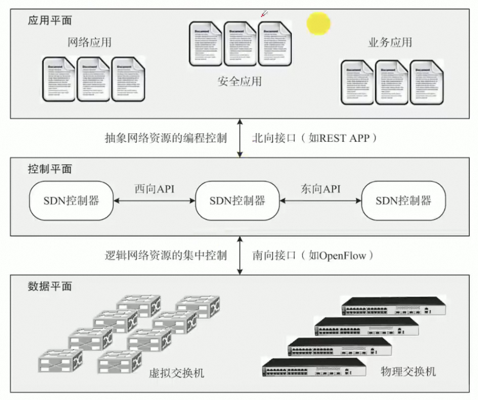

# 信息技术及其发展

## 计算机网络
**网络分类**：PAN、LAN、MAN、WAN、Public Network、Private Network

**OSI七层网络模型**：
1. 应用层
2. 表示层
3. 会话层
4. 传输层
5. 网络层
6. 数据链路层
7. 物理层

**IEEE 802协议族**：传输介质、传输数据方法
1. 802.1：协议概论
2. 802.2：逻辑链路控制层LLC
3. 802.3：以太网CSMA/CD载波监听多路访问/冲突检测协议
4. 802.4：令牌总线协议
5. 802.5：令牌环协议
6. 802.6：城域网MAN协议
7. 802.7：FDDI宽带技术协议
8. 802.8：光纤技术协议
9. 802.9：语音数据集协议
10. 802.10：局域网安全互操作协议
11. 802.11：无线局域网WLAN

**TCP/IP**：四层模型，Internet的核心
* 传输层：TCP/UDP
* 应用层：IP
  * FTP：文件传输协议
  * TFTP：简单文件传输协议（UDP）
  * HTTP：超文本传输协议
  * SMTP：邮件传输协议
  * DHCP：动态主机配置协议（UDP），自动分配IP地址
  * Telnet：远程登陆协议
  * DNS：域名解析系统（UDP）
  * SNMP：简单网络管理协议
* 网络层：IP、ICMP、IGMP、ARP、RARP

**软件定义网络（SDN）**：网络虚拟化---分离控制层和数据层
  
记口诀：南数北应东西控

**第五代移动通信技术**：高速率、低时延、大连接  
5G 的三大类应用场景，即增强移动宽带（eMBB）、超高可靠低时延通信(uRLLC) 和海量机器类通信（mMTC）

## 存储和数据库
* 存储虚拟化是云存储的核心技术之一
* DAS：直连；NAS：网络；SAN：数据中心
* 数据结构模型：层次（格式化）、网状（格式化）、关系
* 数据仓库：数据源、数据存储管理、OLAP服务器、前端工具

## 信息安全
* 属性（**米用完**）：保密性、完整性、可用性
* 层次（**宿舍内涵**）：设备安全、数据安全、内容安全、行为安全
* 对称加密：DES、AES、TDEA、RC4
* 非对称加密：RSA、ElGamal、ECC、DH
* UEBA（用户和实体行为分析）系统：数据获取层、算法分析层、场景应用层
* 网络安全态势感知：预测未来，基于环境、动态、整体洞悉安全风险能力。前提是安全大数据。

# 新一代信息技术与应用

物联网、云计算、大数据、区块链、人工智能、虚拟现实

信息技术发展趋势和新技术应用主要包括以下几个方面：
1、高速度大容量；2、集成化和平台化 ；3、智能化； 4、虚拟计算； 5、通信技术； 6、遥感和传感技术；7、移动智能终端；8、以人为本 ；9、信息安全。

## 物联网
技术基础：
* 感知层：识别物体采集信息的来源（传感器）
* 网络层：中枢
* 应用层：用户的接口

关键技术：
* 传感器技术：RFID（射频识别）
* 传感网：MEMS（微机电系统）
* 应用系统框架：机器、传感器硬件、通信网络、中间件、应用

## 云计算
**快速、按需、弹性**  
* 基础设施即服务：IaaS——基础设施
* 平台即服务：PaaS——平台化
* 软件即服务：SaaS——应用软件  
关键技术：
* 虚拟化技术：多任务、虚拟化、超线程、容器
* 云存储技术
* 多租户和访问控制管理
  * 访问控制原理是**核心问题**——云计算访问控制模型（基于任务、基于属性模型、基于UCON、基于BLP）
  * 云中多租户及虚拟化访问控制是云计算的**典型特征**
* 云安全技术

## 大数据
数据海量、数据类型多样、数据价值密度低、数据处理速度快  
主流分布式计算系统：
* Hadoop：离线复杂
* Spark：离线快速
* Storm：在线实时

## 区块链
去中心化存储、隐私保护、防篡改  
特征：多中心化、多方维护、时序数据、智能合约、不可篡改、开放共识、安全可信  
关键技术：分布式账本、加密算法（哈希&非对称）、共识机制