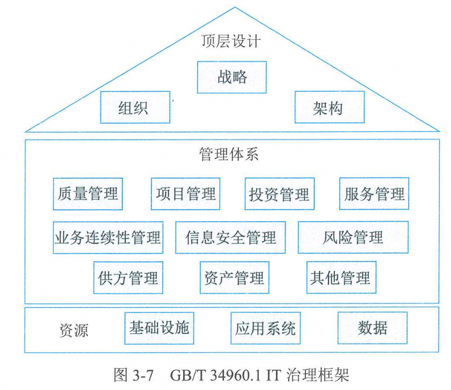
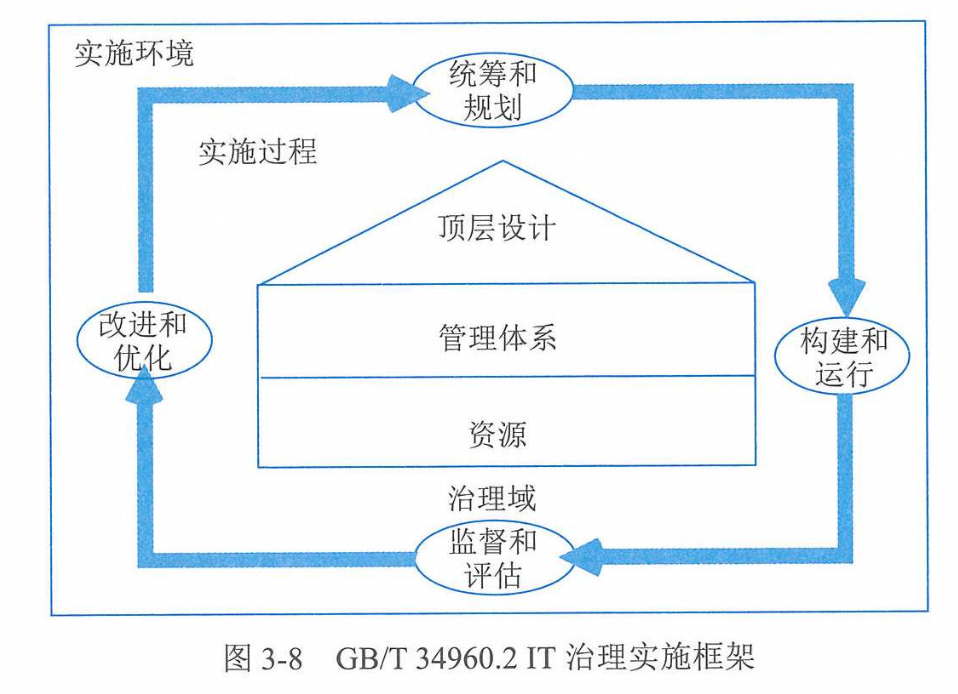

# 信息系统治理

## IT治理

### IT治理基础
1. 定义：IT 治理是描述组织采用有效的机制对信息技术和数据资源开发利用，平衡信息化发展和数字化转型过程中的风险，确保实现组织的**战略目标**的过程。
2. IT治理主要目标：**与业务目标一致**、**有效利用信息与数据资源**、**风险管理**。
3. IT治理要从组织目标和数字战略中抽取信息需求和功能需求，形成总体的IT治理框架和系统整体模型。
4. IT治理将帮助组织建立以**组织战略**为导向、以实现**IT与业务匹配**为重心、以**价值交付**为成果、以**绩效管理**为控制手段的IT管理体制
5. IT治理要保证总体战略目标能够从上而下贯彻执行，治理层主要集中在最高管理层（如董事会）和管理执行层。
6. 管理层次大致可分为三层：**最高管理层**（证实、指导）、**执行管理层**（建设、制定、管理）、**业务与服务执行层**（支持、维护、响应）。

### IT治理体系
1. IT治理的核心：关注IT定位和信息化建设与数字化转型的责权利划分（**定性质**）
2. IT治理体系的构成：IT治理流程、IT治理内容、IT定位、IT治理架构、IT治理效果（**刘荣定驾校**）
3. IT治理的五项关键决策：IT原则、IT架构、IT基础建设、业务应用需求、IT投资和优先顺序（**原价基业咨询**）
4. IT治理体系框架：IT战略目标、IT治理组织、IT治理机制、IT治理域、IT治理标准、IT绩效目标（**劣质机遇标记**）
5. IT治理本质关心：实现IT的业务价值、IT风险的规避。前者通过IT与业务战略匹配实现，后者通过在组织内部建立相关职责实现
6. IT治理核心内容：风险管理、资源管理、组织职责、价值交付、战略匹配、绩效管理（**疯子租架战机**）
7. 建立IT治理机制的原则：简单、透明、适合
  
### IT治理任务
活动定义：统筹、指导、监督和改进。  
主要任务：创新发展、文化助推、机制保障、价值导向、全局统筹（**新推鸡架桶**）

### IT治理方法与标准
通用要求——IT治理框架   

实施指南——IT治理实施框架  

**【重点考点：三大治理域（顶层设计、管理体系、资源）】**

## IT审计

### IT审计基础
* 组织的IT目标：战略一致、保护信息资产安全、提高信息系统安全性可靠性有效性、合理保证信息系统运用符合有关法律  
* IT审计范围：总体范围（目的和成本）、组织范围（机构流程人员）、物理范围（物理边界）、逻辑范围（信息系统和逻辑边界）  
* IT审计风险：固有风险（IT活动本身相关，审计人员无法控制影响）、控制风险（属于内部控制范畴，和制度有关）、检查风险（审计规范、审计人员自身等问题）、总体审计风险（**固执查总**）

### 审计方法与技术
* 方法：访谈法、调查法、检查法、观察法、测试法、程序代码检查法  
* 技术：风险评估技术、审计抽样技术、计算机辅助审计技术、大数据审计技术（**封神算数**）  
* 审计抽样：从审计对象总体中选出一部分作为样本测试。分为统计抽样和非统计抽样，统计抽样分为属性抽样和变量抽样。
  * 统计抽样：采用概率学原理，涉及计算样本量、抽取样本。有效的统计抽样结果是量化的。常用属性抽样（针对特性）和变量抽样（针对变量）。
  * 非统计抽样：采用审计人员判断来确定抽样方法、样本量和标准
* 大数据审计技术：大数据智能分析技术、大数据可视化分析技术、多数据源综合分析技术（**能化缘**）  
* 审计证据：由审计机构和人员获取，支柱、基础、关键。
  * 五大特性：充分性、客观性、相关性、可靠性、合法性。
* 审计工作底稿：证据载体，分为综合类工作底稿、业务类工作底稿、备查类工作底稿（**荷叶茶**）
  * 综合类工作底稿：在审计计划阶段和审计报告阶段
  * 业务类工作底稿：在审计实施阶段
  * 备查类工作底稿；在审计过程中
* 审计工作底稿三级复核制度

### 审计流程（准时终序）
1. 审计准备
2. 审计实施
3. 审计终结
4. 后续审计

### 审计内容
IT内部审计——应用控制审计、IT一般控制审计、组织层面IT控制审计  
IT专项审计——看看和信息系统相关

