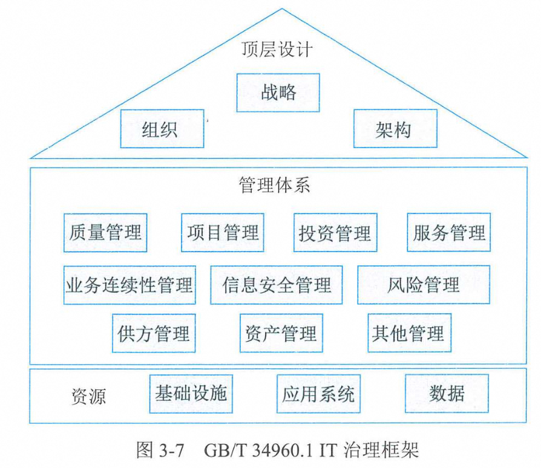
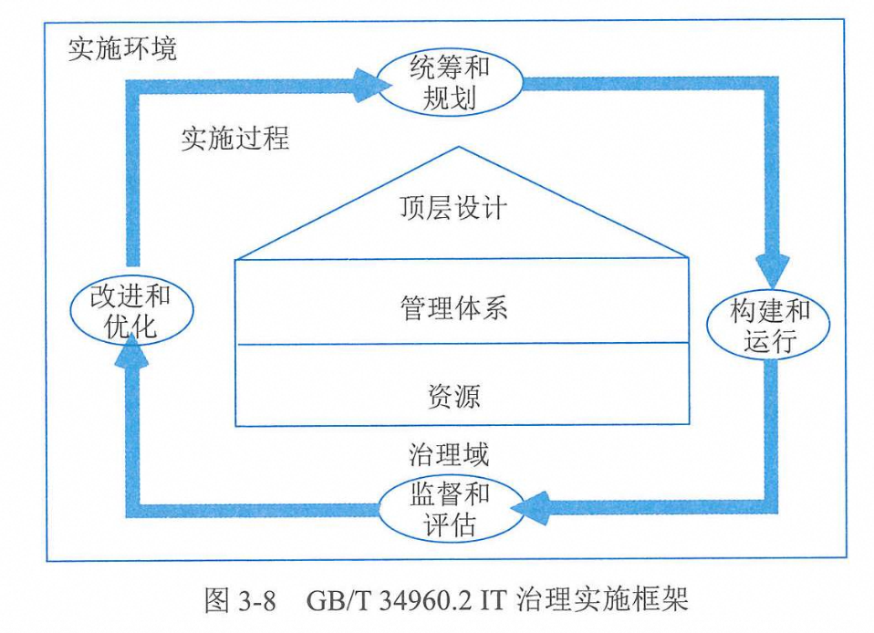

# 信息系统治理

## IT治理

### IT治理基础
1. 定义：IT 治理是描述组织采用有效的机制对信息技术和数据资源开发利用，平衡信息化发展和数字化转型过程中的风险，确保实现组织的**战略目标**的过程。
2. IT治理主要目标：**与业务目标一致**、**有效利用信息与数据资源**、**风险管理**。
3. IT治理要从组织目标和数字战略中抽取信息需求和功能需求，形成总体的IT治理框架和系统整体模型。
4. IT治理将帮助组织建立以**组织战略**为导向、以实现**IT与业务匹配**为重心、以**价值交付**为成果、以**绩效管理**为控制手段的IT管理体制
5. IT治理要保证总体战略目标能够从上而下贯彻执行，治理层主要集中在最高管理层（如董事会）和管理执行层。
6. 管理层次大致可分为三层：**最高管理层**（证实、指导）、**执行管理层**（建设、制定、管理）、**业务与服务执行层**（支持、维护、响应）。

### IT治理体系
1. IT治理的核心：关注IT定位和信息化建设与数字化转型的责权利划分（**定性质**）
2. IT治理体系的构成：IT治理流程、IT治理内容、IT定位、IT治理架构、IT治理效果（**刘荣定驾校**）
3. IT治理的五项关键决策：IT原则、IT架构、IT基础建设、业务应用需求、IT投资和优先顺序（**原价基业咨询**）
4. IT治理体系框架：IT战略目标、IT治理组织、IT治理机制、IT治理域、IT治理标准、IT绩效目标（**劣质机遇标记**）
5. IT治理本质关心：实现IT的业务价值、IT风险的规避。前者通过IT与业务战略匹配实现，后者通过在组织内部建立相关职责实现
6. IT治理核心内容：风险管理、资源管理、组织职责、价值交付、战略匹配、绩效管理（**疯子租架战机**）
7. 建立IT治理机制的原则：简单、透明、适合
  
### IT治理任务
活动定义：统筹、指导、监督和改进。  
主要任务：创新发展、文化助推、机制保障、价值导向、全局统筹（**新推鸡架桶**）

### IT治理方法与标准
通用要求——IT治理框架   

实施指南——IT治理实施框架  

**【重点考点：三大治理域（顶层设计、管理体系、资源）】**

## IT审计

#### 信息系统

- 信息系统是由计算机硬件、网络和通讯设备、计算机软件、**信息资源、信息用户和规章制度**组成的以处理信息流为目的的人机一体化系统

#### 信息系统规划

- 三个阶段

  - 数据处理为核心，围绕职能部门需求进行，主要方法有企业系统规划法、关键成功因素法、战略集合转发法
  - 企业内部管理系统为核心，围绕企业整体需求进行，主要有战略数据规划法、信息工程法和战略栅格法
  - 集成为核心，围绕企业战略需求进行，方法包括价值链分析法和战略一致性模型

- 工具

  - CU（企业过程数据）矩阵：用于划分子系统

  - RD（资源、数据）矩阵：用于定义数据类

  - P/O（过程/组织）矩阵：用于分析过程和组织联系

  - PERT和甘特图

  - IPO图：用于输入输出

#### 项目管理办公室（PMO）

- 对个项目进行资源平衡是项目管理办公室的职责之一。必须确保人员和资源的最佳使用。

  

#### 大型信息系统特征：

1、规模庞大。 2、跨地域性。3、网络结构复杂：大型信息系统一般采用多级网络结构、跨域多个安全域、网络关系复杂、接口众多。 4、业务种类多。 5、数据量大。 6、用户多。

#### 信息系统安全保护等级

- 第一级，用户自主保护级，信息系统受到破坏后，会对公民、法人和其他组织的合法权益造成损害，但不损害国家安全、社会秩序和公共利益。该级适用于普通内联网用户。
- 第二级，系统审计保护级，信息系统受到破坏后，会对公民、法人和其他组织的合法权益产生严重损害，或者对社会秩序和公共利益造成损害，但不损害国家安全。该级适用于通过内联网或国际网进行商务活动，需要保密的非重要单位。
- 第三级，安全标记保护级，信息系统受到破坏后，会对社会秩序和公共利益造成严重损害，或者对国家安全造成损害。该级适用于地方各级国家机关、金融单位机构、邮电通信、能源与水源供给部门、交通运输、大型工商与信息技术企业、重点工程建设单位。
- 第四级，结构化保护等级，信息系统受到破坏后，会对社会秩序和公共利益造成特别严重损害，或者对国家安全造成严重损害。该级适用于中央级国家机关、广播电视部门、重要物资储备单位、社会应急服务部门、尖端科技企业集团、国家重点科研单位机构和国防建设等部门。
- 第五级，访问验证保护等级，信息系统受到破坏后，会对国家安全造成特别严重损害。该级适用于国防关键部门和依法需要对计算机信息系统实施特殊隔离单位。

#### 区块链

 区块链是分布式数据存储、点对点传输、共识机制、加密算法等计算机技术的新型应用模式。所谓共识机制是区块链系统中实现不同节点之间建立信任、获取权益的数学算法。特征：

- 去中心化，由于使用分布式核算和存储，不存在中心化的硬件或管理机构，任意节点的权利和义务都是均等的，系统中的数据块由整个系统中具有维护功能的节点来共同维护。
- 系统是开放的，除了交易各方的私有信息被加密外，区块链的数据对所有人公开，任何人都可以通过公开的接口查询区块链数据和开发相关应用，因此整个系统信息高度透明；
- 自治性，区块链采用基于协商一致的规范和协议（比如一套公开透明的算法）使得整个系统中的所有节点能够在去信任的环境自由安全地交换数据，使得对“人”的信任改成了对机器的信任，任何人为的干预都不起作用；
- 信息不可篡改，一旦信息经过验证并添加至区块链，就会永久地存储起来，除非能够同时控制住系统中超过51%的节点，否则单个节点上对数据库的修改是无效的，因此区块链的数据稳定性和可靠性极高；
- 匿名性，由于节点之间的交换遵循固定的算法，其数据交互是无需信任的（区块链中的程序规则会自行判断活动是否有效），因此交易对手无须通过公开身份的方式让对方自己产生信任，对信用的累积非常有帮助。

#### 软件维护有如下类型：

- 更正性维护，是指在使用过程中发现了隐蔽的错误后，为了诊断和改正这些隐蔽错误而修改软件的活动，该类维护一般占总维护工作量的25%；
- 适应性维护，是指为了适应变化了的环境而修改软件的活动，该类维护一般占总维护工作量的20%；
- 完善性维护，是指为了扩充或完善原有软件的功能或性能而修改软件的活动，该类维护一般占总维护工作量的50%；
- 预防性维护，是指为了提高软件的可维护性和可靠性、为未来的进一步改进打下基础而修改软件的活动，该类维护一般占总维护工作量的5%。

