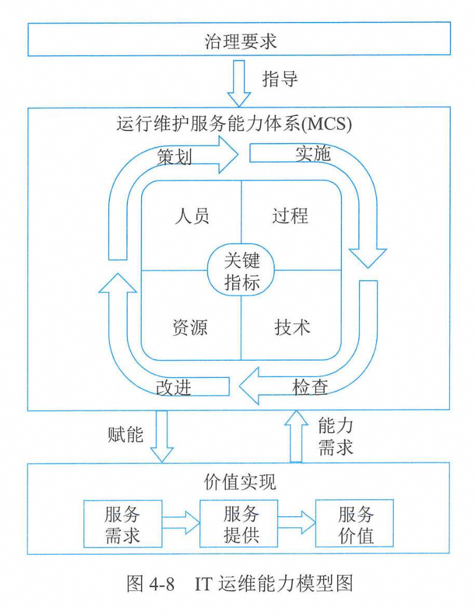
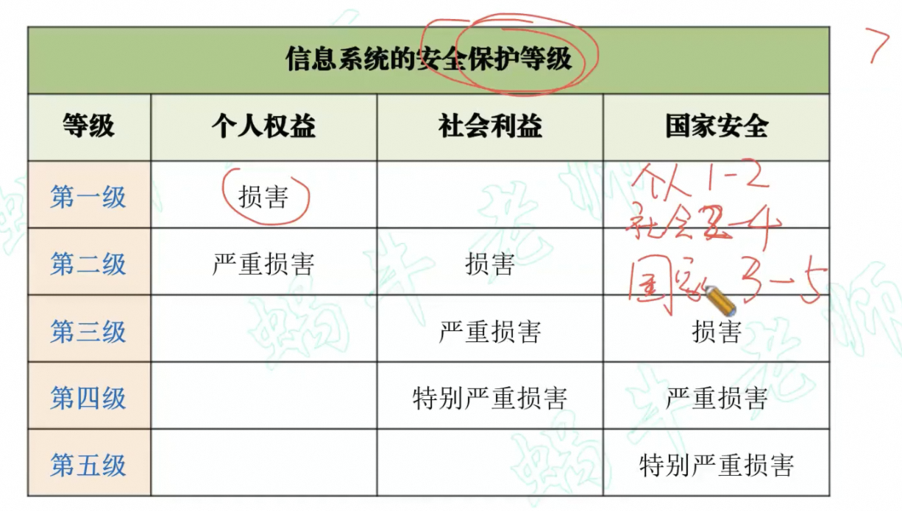

# 信息系统管理

## 管理方法

### 管理基础
1. 层次结构
   * 四个要素：人员、技术、流程、数据
   * 三个层次：（由上到下）管理->信息系统->人机流数
2. 系统管理
   * 四大领域：规划组织、设计实施、运维服务、优化和持续改进

### 规划和组织
针对信息系统的整体组织、战略和支持活动。  

**信息系统战略三角**：业务战略、信息系统战略、组织机制战略。（**夜行组**）
* 业务战略：迈克尔波特的竞争力优势模型。
  * 总成本领先战略
  * 差异性战略
  * 专注化战略——专注成本或专注差异化
* 信息系统战略：四个基础：硬件、软件、网络、数据
* 组织机制模型：哈罗德莱维特的钻石模型
  * 组织计划的关键组分：信息与控制、人员、结构和任务
  * 所有组建相互关联

### 设计和实施
针对信息系统解决方案的定义、采购和实施，以及与业务流程的整合。  

**转换框架**：将业务战略转化为信息系统架构，提出三类问题：内容、人员和位置。  

**体系架构模式**：
* 集中式架构：主机架构。易于管理。
* 分布式架构：基于服务器的架构。比集中式架构更加模块化。
* 面向服务的系统架构（SOA）：基于Web的架构。对于快速构建应用程序很有用，易于变更。

### 运维和服务
针对信息系统服务的运行交付支持和安全。

主要包括：运行管理和控制、IT服务管理、运行与监控、终端侧管理、程序库管理、安全管理、介质控制和数据管理

管理控制的主要活动：过程开发、标准制定、资源分配、过程管理。

IT服务的若干不同活动：
* 服务台：战略单元
* 事件管理：受理、初步支持、诊断解决、进展跟踪、关闭
* 问题管理：旨在减少事件的数量和严重性。【问题是**同类事件**】
* 变更管理：与过程相关，重在管理而非技术
* 配置管理：故障定位、问题分析、变更影响度分析、故障分析
* 发布管理
* 服务级别管理：服务水平协议SLA、服务绩效监控和报告
* 财务管理
* 容量管理：业务容量管理、服务容量管理、资源容量管理
* 服务连续性管理：服务连续性管理的治理、业务影响分析、制定和维护服务连续性计划、测试服务连续性计划、相应和恢复
* 可用性管理

**程序库**：访问控制、程序签出、程序签入、版本控制和代码分析

### 优化和持续改进
针对信息系统的性能监控并持续改进。

**六西格玛**是对戴明环四阶段周期的延伸，包括：定义、度量、分析、改进/设计、控制/验证。（**订两份社恐**）

## 管理要点

### 数据管理

**DCMM**：国家标准GB/T 36073《数据管理能力成熟度评估模型》提出，旨在帮助组织利用先进数据管理理念和方法。  
内容：（**略知佳音，安置准妻**）
* 数据战略：规划、实施、评估（**化石菇**）
* 数据治理：数据治理组织、数据制度建设、数据治理沟通（**治狗子**）
* 数据架构：数据模型、数据分布、数据集成与共享、元数据管理（**缘分莫想**）
* 数据应用：数据分析、开放共享、数据服务（**分开付**）
* 数据安全：策略、管理、审计（**管计策**）
* 数据质量：需求、检查、分析、提升（**求查分身**）
* 数据标准：业务术语、参考数据和主数据、数据元、指标数据（**元彪主页**）
* 数据生存周期：数据需求、数据设计和开发、数据运维、数据退役（**续集唯一**）

DCMM将组织的管理成熟度划分为五个等级：（**出关问良友，被处反恐罪**）
* 初始级：被动式管理
* 受管理级：初步管理
* 稳健级：制定了系列的标准化管理流程，促进数据管理规范化
* 量化管理级：量化分析和监控
* 优化级：实施优化，能在行业内进行最佳实践分享

### 运维管理
**运维能力模型**：围绕人员、过程、技术、资源能力四要素。  

治理指导运维建设，韵味赋能价值实现，价值实现需要能力需求。  
需方提出服务需求，供方提供服务，实现服务价值。  
关键指标：人员能力--选人做事、资源能力--保障做事、技术能力--高效做事、过程--正确做事  
四个阶段：策划、实施、检查、改进

### 信息安全管理
1. CIA三要素：保密性、完整性、可用性（信息安全三元组）
2. 信息安全管理体系：
    * 配备人员
    * 建立安全职能部门
    * 成立小组
    * 出任领导
    * 建立保密部门
3. 网络安全等级保护

4. 安全保护能力等级：个人->小型组织->外部团体->国家