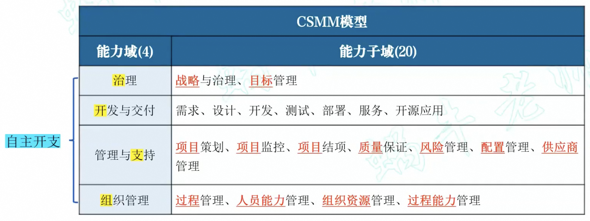
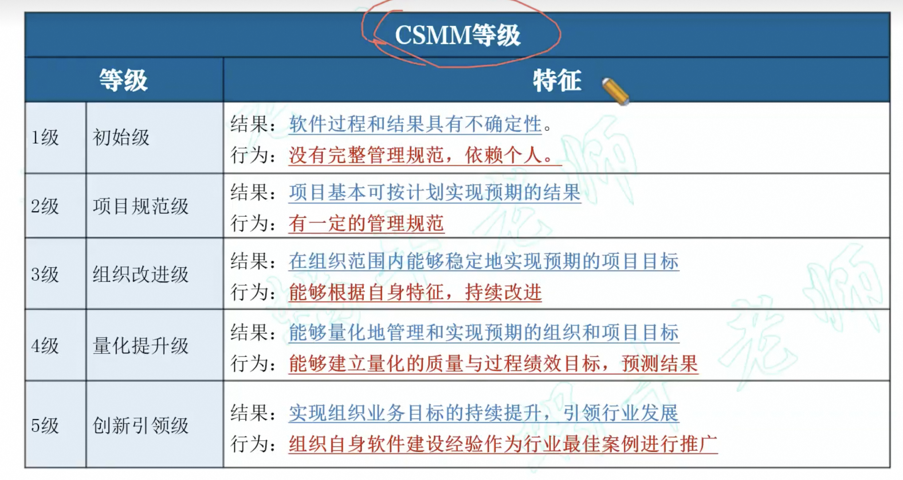

# 软件工程

## 架构设计
五大架构风格：
* 数据流风格：pipe
* 调用/返回风格：主程序/子程序，面对对象
* 独立构件风格：进程通信和事件驱动
* 虚拟机风格：解释器和基于规则的系统（JVM）
* 仓库风格：数据库系统、黑板系统、超文本系统

## 需求分析
需求层次：业务需求、用户需求和系统需求。  
需求过程：需求获取--需求分析--需求规格说明书编制--需求验证与确认
* 结构化分析：**数据模型**（实体联系图ER图）、**功能模型**（数据流图DFD）、**行为模型**（状态转换图STD）
* 面向对象的分析：核心工作是建立系统的**用例模型**和**分析模型**
* 需求规格说明书SRS：包含范围、引用文件、需求、合格性规定、需求可追踪性、尚未解决的问题、注解、附录。

### UML
UML是一种建模语言。  
包括：
1. 构造块：事物Thing、关系Relationship、图Diagram
2. 规则：构造块如何放在一起的规定、命名
3. 公共机制：达到特定目标的公共UML方法，包括规格说明、修饰、公共分类和扩展机制

**软件需求可分为功能需求、性能需求、外部接口需求、设计约束和质量属性。**

## 软件设计
1. 结构化设计SD：高内聚，低耦合。
2. 面向对象设计OOD【一种更接近现实世界，更自然的软件设计方法】
   * 单职原则：设计功能单一的类【高内聚】
   * 开闭原则：对扩展开放，对修改封闭
   * 里氏替换原则：子类可以替换父类
   * 依赖倒置原则：依赖于抽象而非实现，针对接口而非实现
   * 接口隔离原则：使用多个专门接口，而非单一总接口
   * 组合重用原则：尽量使用组合而非继承关系达到重用
   * 迪米特原则（最小知识法则）：一个对象应当对其他对象有尽可能少的了解【低耦合】
3. 设计模式：类模式（继承，编译，静态）和对象模式（动态）

## 软件实现

### 软件测试

- 软件测试方法可分为静态测试和动态测试。
  - **静态测试**是指被测试程序不在机器上运行，而采用人工检测和计算机辅助静态分析的手段对程序进行检测。静态测试包括对文档的静态测试和对代码的静态测试。对**文档**的静态测试主要以**检查单**的形式进行，而对**代码**的静态测试一般采用**桌前检查**（DeskChecking）、**代码走查**和**代码审查**
  - **动态测试**是指在计算机上实际运行程序进行软件测试，一般采用白盒测试和黑盒测试方法。**白盒测试也称为结构测试**，主要用于软件单元测试中。它的主要思想是，将程序看作是一个透明的白盒，测试人员完全清楚程序的结构和处理算法，按照程序内部逻辑结构设计测试用例，检测程序中的主要执行通路是否都能按预定要求正确工作。白盒测试方法主要有控制流测试、数据流测试和程序变异测试等。**黑盒测试也称为功能测试**，主要用于集成测试、确认测试和系统测试。黑盒测试将程序看作一个不透明的黑盒，完全不考虑程序的内部结构盒处理算法，只检查程序功能是否能按照SRS的要求正常使用。黑盒测试根据SRS所规定的功能来设计测试用例。
- 根据国家标准GB/T 15532—2008，软件测试可分为单元测试、集成测试、确认测试、 系统测试、配置项测试和回归测试等类别。
  - 单元测试。单元测试也称为模块测试，测试的对象是可独立编译或汇编的程序模块、软件构件或软件中的类（统称为模块），其目的是检查每个模块能否正确地实现设计说明中的功能、性能、接口和其他设计约束等条件，发现模块内可能存在的各种差错。单元测试的技术依据是软件详细设计说明书，着重从模块接口、局部数据结构、重要的执行通路、出错处理通路和边界条件等方面对模块进行测试。
  - 集成测试。集成测试的目的是检查模块之间，以及模块和已集成的软件之间的接口关系，并验证已集成的软件是否符合设计要求。集成测试的技术依据是软件概要设计文档。除应满足一般的测试准入条件外，在进行集成测试前还应确认待测试的模块均已通过单元测试。
  - 确认测试。确认测试主要用于验证软件的功能、性能和其他特性是否与用户需求一致。根据用户的参与程度，通常包括以下类型。
    - 内部确认测试。内部确认测试主要由软件开发组织内部按照SRS进行测试。
    - Alpha测试和Beta测试。对于通用产品型的软件开发而言，Alpha测试是指由用户在开发环境下进行测试，通过Alpha测试以后的产品通常称为Alpha版；Beta，测试是指由用户在实际使用环境下进行测试，通过Beta测试的产品通常称为Beta 版。一般在通过Beta测试后，才能把产品发布或交付给用户。
    - 验收测试。验收测试是指针对SRS，在交付前以用户为主进行的测试。其测试对象为完整的、集成的计算机系统。验收测试的目的是，在真实的用户工作环境下， 检验软件系统是否满足开发技术合同或SRS。验收测试的结论是用户确定是否接收该软件的主要依据。除应满足一般测试的准入条件外，在进行验收测试之前还应确认被测软件系统已通过系统测试。
  - 系统测试。系统测试的对象是完整的、集成的计算机系统，系统测试的目的是在真实系统工作环境下，验证完整的软件配置项能否和系统正确连接，并满足系统/子系统设计文档和软件开发合同规定的要求。系统测试的技术依据是用户需求或开发合同，除应满足一般测试的准入条件外，在进行系统测试前，还应确认被测系统的所有配置项已通过测试，对需要固化运行的软件还应提供固件。一般来说，系统测试的主要内容包括功能测试、健壮性测试、性能测试、用户界面测试、安全性测试、安装与反安装测试等，其中，最重要的工作是进行功能测试与性能测试。功能测试主要采用黑盒测试方法；性能测试主要验证软件系统在承担一定负载的情况下所表现出来的特性是否符合客户的需要，主要指标有响应时间、吞吐量、并发用户数和资源利用率等。
  - 配置项测试。配置项测试的对象是软件配置项，配置项测试的目的是检验软件配置项与SRS的一致性。配置项测试的技术依据是SRS （含接口需求规格说明）。除应满足一般测试的准入条件外，在进行配置项测试之前，还应确认被测软件配置项已通过单元测试和集成测试。
  - 回归测试。回归测试的目的是测试软件变更之后，变更部分的正确性和变更需求的符合性，以及软件原有的、正确的功能、性能和其他规定的要求的不损害性。

- 测试类型：
  - 回归测试：回归测试是指修改了旧代码后，重新进行测试以确认修改没有引入新的错误或导致其他代码产生错误。自动回归测试将大幅降低系统测试、维护升级等阶段的成本。
  - 集成测试：是软件生命周期中的测试活动之一。集成测试也叫组装测试或联合测试。在单元测试的基础上，将所有模块按照设计要求组装称为子系统或系统，进行集成测试。
  - 冒烟测试的对象是每一个新编译的需要正式的软件版本，目的是确认软件基本功能正常，可以进行后续的正式测试工作。冒烟测试的执行者是版本编译人员。

- 测试管理
  - 测试管理是为了实现测试工作的预期目标，以测试人员为中心，对测试生命周期及其所涉及的相应资源进行有效的计划、组织、领导和控制的活动
  - 测试管理过程包括制定测试计划及用例、执行测试、发现并报告缺陷、修正缺陷、重新测试。

- 测试风险管理：
  - 缺陷风险：某些缺陷偶发，难以重视，容易被遗漏。
  - 测试环境风险：有些情况下测试环境与产生环境不能完全一致，导致测试结果存在误差。
  - 回归测试风险：回归测试一般不运行全部测试用例，可能存在测试不完全。
  - 测试技术风险：某些项目存在技术难度，测试能力和水平导致测试进展缓慢，项目延期。
- 测试监控的内容:四缺一进，测试用例执行的进度，缺陷的存活时间，缺陷的趋势分析，缺陷分布密度，缺陷修改质量

#### 软件可靠新和可维护性管理标准，需求评审包括

- 可靠性和可维护性目标
- 实施计划
- 功能降级使用方式下，软件产品最低功能保证的规格说明
- 选用或定制的规范和准则
- 验证方法

## 部署交付
持续交付：一系列开发实践方法，保证代码快速安全地部署到生产环境中。  
持续部署：
* 方案：容器技术是最流行的技术，如K8S+Docker和Matrix系统
* 部署层次：部署的目的不是部署一个可工作的软件，而是部署一套可正常运行的环境
* 部署三环节
    1. Build：编译
    2. Ship：安装
    3. Run：启动
* 两大部署方式
    1. 蓝绿部署：部署的时候准备新旧两个部署版本，通过域名解析切换的方式将用户使用环境切换到新版本中，当出现问题的时候可以快速切换到旧版本，对新版本进行修复。
    2. 金丝雀部署：先让少量用户使用新版本，观察是否存在问题。

## 过程管理
1. 成熟度模型CSMM

