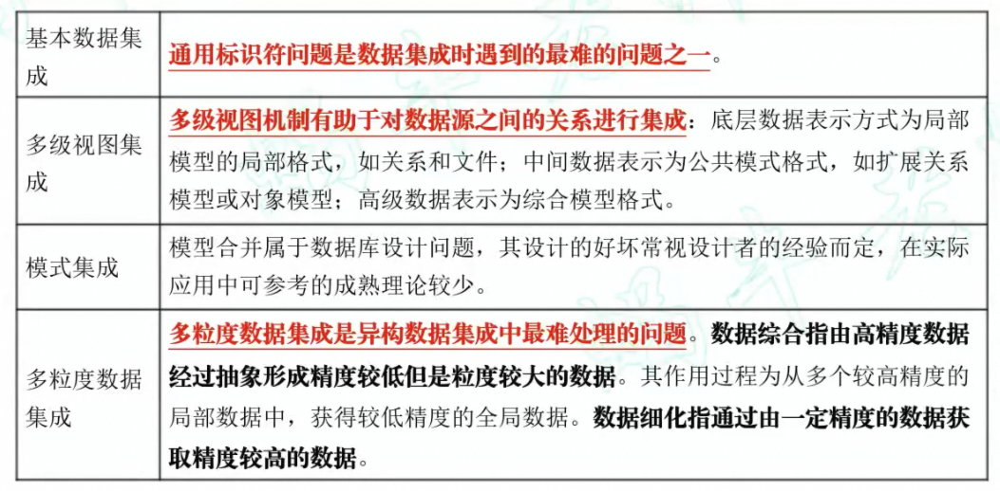
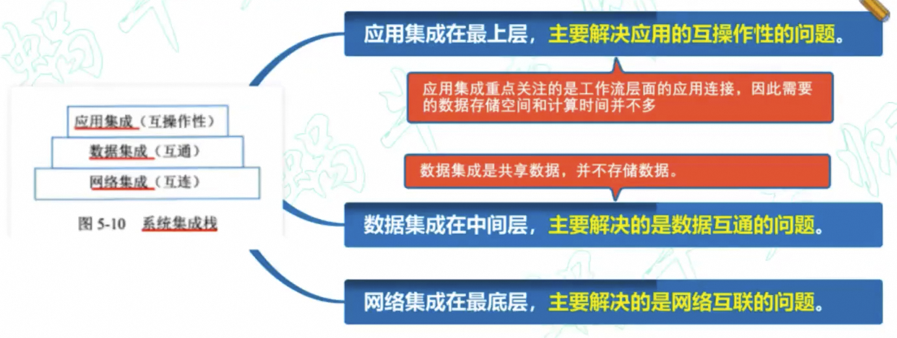

# 系统集成

技术环境集成、数据环境集成、应用程序集成。  
四个原则：开放性、结构化、先进性、主流化。  
网络集成：
1. 传输子系统：传输介质（无线和有线）
2. 交换子系统：局域网、城域网、广域网
3. 安全子系统：防火墙技术、数据加密技术、访问控制
4. 网管子系统：保证网络良好运行
5. 服务器子系统：考虑CPU、内存、总线结构、磁盘、容错性能、网络接口、服务器软件等
6. 网络操作系统：调度和管理网络资源
7. 服务子系统
   
## 数据集成
数据集成的目的是运用一定的技术手段将系统中的数据按一定的规则组织成为一个整体，使得用户能有效地对数据进行操作。数据集成处理的主要对象是系统中各种**异构数据库**中的数据。**数据仓库技术是数据集成的关键**。
### 数据集成层次
基本数据集成、多级视图集成、模式集成、多粒度数据集成。（本多莫赌）

### 异构数据集成
集成数据必须保证数据完整性和约束完整性。  
**方法**：过程式方法、声明式方法、中间件集成异构数据库。  
**中间件集成异构数据库**：该方法不需要改变原始数据的存储和管理方式。中间件位于异构数据库系统（数据层）【上方】和应用程序（应用层）【下方】之间，向下协调各数据库系统，向上为访问集成数据的应用提供统一的数据模式和数据访问的通用接口。各数据库仍完成各自的任务，中间件则主要为异构数据源提供一个高层次的检索服务。  
**开放数据库互联标准**：实现异构数据源的数据集成，**首先**要解决的问题是原始数据的提取。从异构数据库中提取数据的方法：ODBC、嵌入式C接口程序。  
**基于XML的数据交换标准**：一套标准的格式，易于数据交换。  
**基于JSON的数据交换模式**：JSON是一种轻量级的数据交换格式。

## 软件集成
* COBRA：OMG是CORBA规范的制定者，CORBA是OMG进行标准化分布式对象计算的基础。
* COM：COM 中的对象是一种二进制代码对象，其代码形式是DLL或EXE执行代码。COM对象可能由各种编程语言实现，并为各种编程语言所引用。
* DCOM：DCOM实际上是对用户调用进程外服务的一种改进，通过RPC协议，使用户通过网络可以以透明的方式调用远程机器上的远程服务。
* COM+：底层结构仍然以COM为基础，它把COM组件软件提升到应用层而
不再是底层的软件结构。
* .NET：VB、C++、C#、JScipt、ASP.NET、ADO.NET
* J2EE：J2EE的体系结构可以分为四层，客户端层、服务器端组件层、EJB层和信息系统层。它还提供了EJB、Java Servlets API、JSP和XML技术的全面支持。

## 应用集成
1. 如果一个系统支持位于同一层次上的各种构件之间的信息交换，那么称该系统支持**互操作性**。
2. 如果一个开放系统提供在系统各构件之间交换信息的机制，也称该系统支持**互操作性**。
3. 如果一个子系统(构件或部分）可以从一个环境移植到另一个环境，称它是**可移植的**。因此，可移植性是由系统及其所处环境两方面的特征决定的。
4. 集成关心的是个体和系统的所有硬件之间的软件之间各种人机界面的一致性。

5. 对应用集成的技术要求大致有：具有应用间的互操作性、具有分布式环境中应用的可移植性、具有系统中应用分布的透明性。
6. 可以帮助协调连接各种应用的组件有：
   1. 应用编程接口：API利用特定的数据结构，帮助开发人员快速访问其他应用的功能。
   2. 事件驱动操作：当触发器（即事件）启动一个程序或一组程序时，系统就会执行事件驱动型操作。
   3. 数据映射：将数据从一个系统映射到另一个系统，可以定义数据的交换方式，从而简化后续的数据导出、分组或分析工作。