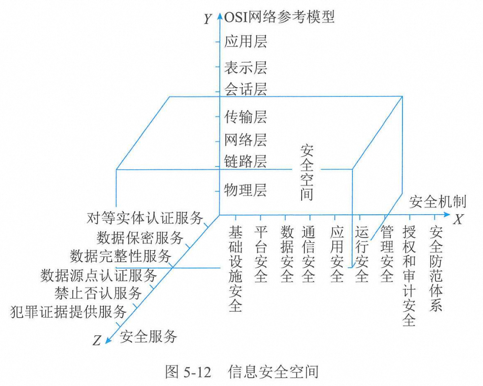

# 安全工程

## 安全系统

(1)X轴是“安全机制”。安全机制可以理解为提供某些安全服务，利用各种安全技术和技巧，所形成的一个较为完善的结构体系。如“平台安全”机制，实际上就是指安全操作系统、安全数据库、应用开发运营的安全平台以及网络安全管理监控系统等。  
(2)Y轴是“OSI网络参考模型”。信息安全系统的许多技术、技巧都是在网络的各个层面上实施的，离开网络信息系统的安全也就失去意义。  
(3)Z轴是“安全服务”。安全服务就是从网络中的各个层次提供给信息应用系统所需要的安全服务支持。如对等实体认证服务、访问控制服务、数据保密服务等。  
由XYZ三个轴形成的信息安全系统三维空间就是信息系统的“安全空间”
。随着网络的逐层扩展，这个空间不仅范围逐步加大，安全的内涵也就更丰富，达到具有**认证、权限、完整、加密和不可否认五大要素**，也叫作“安全空间”的五大属性。

1. 安全机制  
**安全机制**包含基础设施实体安全、平台安全、数据安全、通信安全、应用安全、运行安全、管理安全、授权和审计安全、安全防范体系等。  
   * 平台安全主要包括主要包括操作系统漏洞检测与修复、网络基础设施漏洞检测与修复、通用基础应用程序漏洞检测与修复、网络安全产品部署等
   * 应用安全：业务业务业务

2. 安全服务  
**安全服务**包括对等实体认证服务、数据保密服务、数据完整性服务、数据源点认证服务、禁止否认服务和犯罪证据提供服务等【**等保晚点认罪**】
   * 对等实体认证服务：用于两个开放系统同等层中的实体建立链接或数据传输时，对对方实体的合法性、真实性进行确认，以防假冒。
   * 数据保密服务：为了防止网络中各系统之间的数据被截获或被非法存取而泄密，提供密码加密保护。
   * 数据完整性服务：防止非法实体对交换数据的修改、插入、删除以及在数据交换过程中的数据丢失。
   * 数据源点认证服务：确保数据发自真正的源点，防止假冒。
   * 禁止否认服务：防止发送方在发送数据后否认自己发送过此数据,接收方在收到数据后否认自己收到过此数据或伪造接收数据，由两种服务组成：不得否认发送和不得否认接收。
   * 犯罪证据提供服务：指为违反国内外法律法规的行为或活动，提供各类数字证据、信息线索等。

3. 安全技术  
   加密、数字签名技术、防控控制、数据完整性、认证、数据挖掘。

## 工程体系架构
1. ISSE-CMM基础：是一种衡量信息安全系统工程实施能力的方法，是使用**面向工程过程**的一种方法。
   1. ISSE-CMM是建立在统计过程控制理论的基础上的。
   2. ISSE-CMM主要适用于工程组织、获取组织和评估组织。
2. ISSE过程【保工分】
   1. 工程过程
   2. 风险过程
   3. 保证过程
3. ISSE-CMM体系结构：公共特性的成熟度等级定义
   1. Level1--非正规实施级--基本实施
   2. Level2--规划和跟踪级--规范化执行
   3. Level3--充分定义级--标准化过程
   4. Level4--量化控制级--可测量、量化
   5. Level5--持续改进级--持续改进